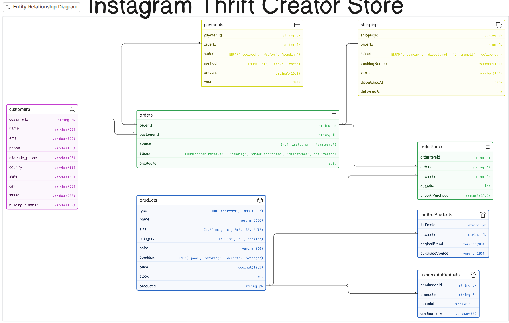

```JS
customers [icon: user, color: Purple] {
  customerId string pk
  name varchar(50)
  email varchar(322)
  phone varchar(15)
  alternate_phone varchar(15)
  country varchar(50)
  state varchar(50)
  city varchar(50)
  street varchar(255)
  building_number varchar(50)
}

products [icon: box, color: Blue] {
  productId string pk
  type ENUM('thrifted', 'handmade')
  name varchar(100)
  size ENUM('xs', 's', 'm', 'l', 'xl')
  category ENUM('m', 'f', 'child')
  color varchar(50)
  condition ENUM('good', 'amazing', 'decent', 'average')
  price decimal(10,2)
  stock int
}

thriftedProducts [icon: shirt, color: blue] {
  thriftedId string pk
  productId string fk
  originalBrand varchar(100)
  purchaseSource varchar(100)
}

handmadeProducts [icon: shirt, color: blue] {
  handmadeId string pk
  productId string fk
  material varchar(100)
  craftingTime varchar(50)
}

orders [icon: list, color: green] {
  orderId string pk
  customerId string fk
  source ENUM('instagram', 'whatsapp')
  status ENUM('order_received', 'pending', 'order_confirmed', 'dispatched', 'delivered')
  createdAt date
}

orderItems [icon: list, color: green] {
  orderItemId string pk
  orderId string fk
  productId string fk
  quantity int
  priceAtPurchase decimal(10,2)
}

payments [icon: credit-card, color: yellow] {
  paymentId string pk
  orderId string fk
  status ENUM('received', 'failed', 'pending')
  method ENUM('upi', 'bank', 'card')
  amount decimal(10,2)
  date date
}

shipping [icon: truck, color: yellow] {
  shippingId string pk
  orderId string fk
  status ENUM('preparing', 'dispatched', 'in_transit', 'delivered')
  trackingNumber varchar(100)
  carrier varchar(100)
  dispatchedAt date
  deliveredAt date
}

customers.customerId < orders.customerId
orders.orderId < orderItems.orderId
products.productId < orderItems.productId
products.productId < thriftedProducts.productId
products.productId < handmadeProducts.productId
orders.orderId - payments.orderId
orders.orderId - shipping.orderId
```
