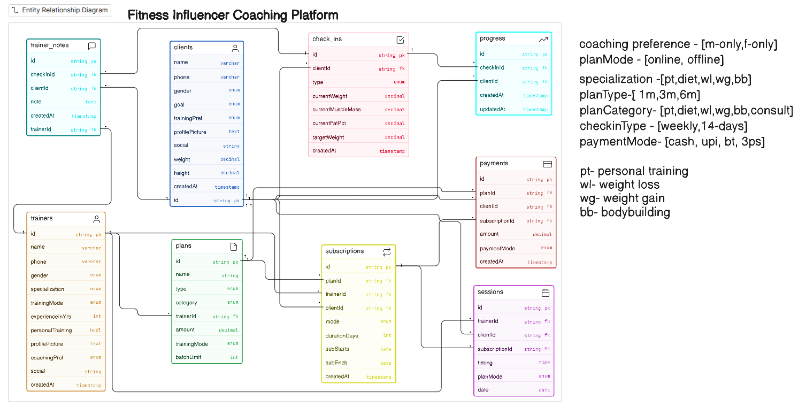
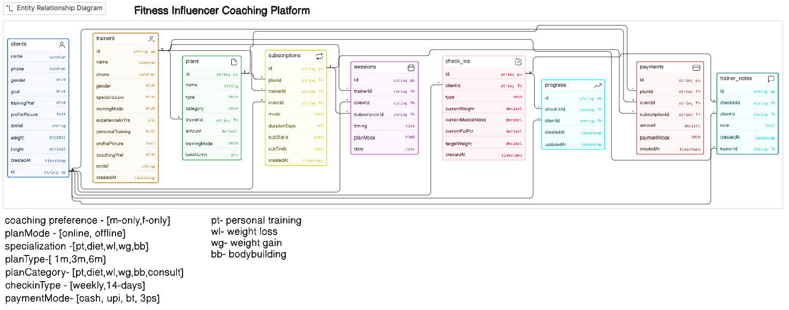

code

```JS
clients [icon: user, color: blue] {
  id string pk
  name varchar
  phone varchar
  gender enum
  goal enum
  trainingPref enum
  profilePicture text
  social string
  weight decimal
  height decimal
  createdAt timestamp
}

trainers [icon: user, color: orange] {
  id string pk
  name varchar
  phone varchar
  gender enum
  specialization enum
  trainingMode enum
  experienceInYrs int
  personalTraining bool
  profilePicture text
  coachingPref enum
  social string
  createdAt timestamp
}

plans [icon: file, color: green] {
  id string pk
  name string
  type enum
  category enum
  trainerId string fk
  amount decimal
  trainingMode enum
  batchLimit int
}

subscriptions [icon: repeat, color: yellow] {
  id string pk
  planId string fk
  trainerId string fk
  clientId string fk
  mode enum
  durationDays int
  subStarts date
  subEnds date
  createdAt timestamp
}

sessions [icon: calendar, color: purple] {
  id string pk
  trainerId string fk
  clientId string fk
  subscriptionId string fk
  timing time
  planMode enum
  date date
}

check_ins [icon: check-square, color: pink] {
  id string pk
  clientId string fk
  type enum
  currentWeight decimal
  currentMuscleMass decimal
  currentFatPct decimal
  targetWeight decimal
  createdAt timestamp
}

progress [icon: trending-up, color: cyan] {
  id string pk
  checkInId string fk
  clientId string fk
  createdAt timestamp
  updatedAt timestamp
}

payments [icon: credit-card, color: red] {
  id string pk
  planId string fk
  clientId string fk
  subscriptionId string fk
  amount decimal
  paymentMode enum
  createdAt timestamp
}

trainer_notes [icon: message-square, color: teal] {
  id string pk
  checkInId string fk
  trainerId string fk
  clientId string fk
  note text
  createdAt timestamp
}

trainers.id < plans.trainerId
plans.id < subscriptions.planId
trainers.id < subscriptions.trainerId
clients.id < subscriptions.clientId
trainers.id < sessions.trainerId
clients.id < sessions.clientId
subscriptions.id < sessions.subscriptionId
clients.id < check_ins.clientId
check_ins.id < progress.checkInId
clients.id < progress.clientId
clients.id < payments.clientId
plans.id < payments.planId
subscriptions.id < payments.subscriptionId
trainer_notes.checkInId > check_ins.id
trainer_notes.trainerId > trainers.id
trainer_notes.clientId > clients.id
```
