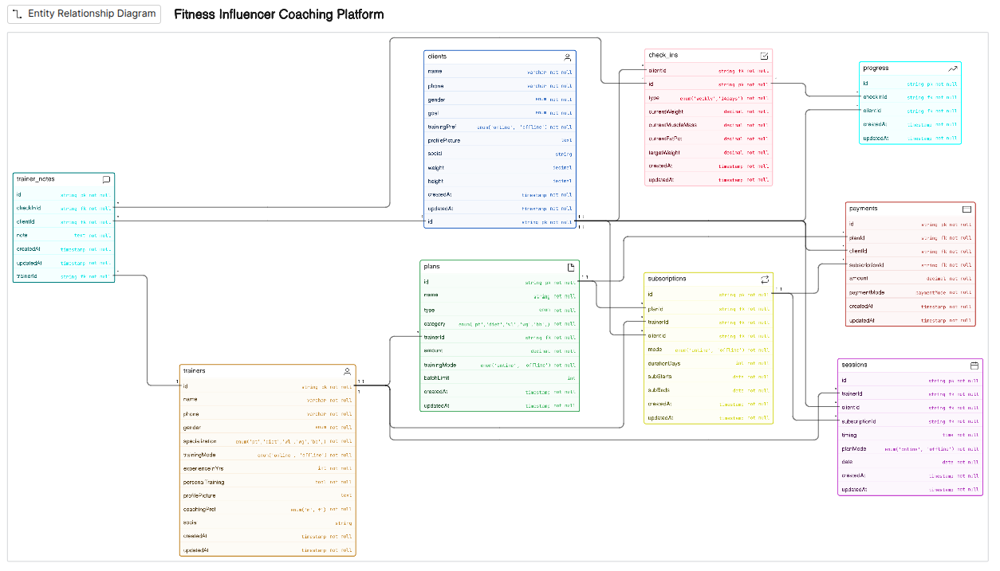

code

```JS
clients [icon: user, color: blue] {
  id string pk not null
  name varchar not null
  phone varchar not null
  gender enum not null
  goal enum not null
  trainingPref enum('online', 'offline') not null
  profilePicture text
  social string
  weight decimal
  height decimal
  createdAt timestamp not null
  updatedAt timestamp not null
}

trainers [icon: user, color: orange] {
  id string pk not null
  name varchar not null
  phone varchar not null
  gender enum not null
  specialization enum('pt','diet','wl','wg','bb',) not null
  trainingMode enum('online', 'offline') not null
  experienceInYrs int not null
  personalTraining bool not null
  profilePicture text
  coachingPref enum('m','f') not null
  social string
  createdAt timestamp not null
  updatedAt timestamp not null
}

plans [icon: file, color: green] {
  id string pk not null
  name string not null
  type enum not null
  category enum('pt','diet','wl','wg','bb',) not null
  trainerId string fk not null
  amount decimal not null
  trainingMode enum('online', 'offline') not null
  batchLimit int
  createdAt timestamp not null
  updatedAt timestamp not null
}

subscriptions [icon: repeat, color: yellow] {
  id string pk not null
  planId string fk not null
  trainerId string fk not null
  clientId string fk not null
  mode enum('online', 'offline') not null
  durationDays int not null
  subStarts date not null
  subEnds date not null
  createdAt timestamp not null
  updatedAt timestamp not null
}

sessions [icon: calendar, color: purple] {
  id string pk not null
  trainerId string fk not null
  clientId string fk not null
  subscriptionId string fk not null
  timing time not null
  planMode enum('online', 'offline') not null
  date date not null
  createdAt timestamp not null
  updatedAt timestamp not null
}

check_ins [icon: check-square, color: pink] {
  id string pk not null
  clientId string fk not null
  type enum('weekly','14days') not null
  currentWeight decimal not null
  currentMuscleMass decimal not null
  currentFatPct decimal not null
  targetWeight decimal not null
  createdAt timestamp not null
  updatedAt timestamp not null
}

progress [icon: trending-up, color: cyan] {
  id string pk not null
  checkInId string fk not null
  clientId string fk not null
  createdAt timestamp not null
  updatedAt timestamp not null
}

payments [icon: credit-card, color: red] {
  id string pk not null
  planId string fk not null
  clientId string fk not null
  subscriptionId string fk not null
  amount decimal not null
  paymentMode paymentMode not null
  createdAt timestamp not null
  updatedAt timestamp not null
}

trainer_notes [icon: message-square, color: teal] {
  id string pk not null
  checkInId string fk not null
  trainerId string fk not null
  clientId string fk not null
  note text not null
  createdAt timestamp not null
  updatedAt timestamp not null
}


//relations

trainers.id < plans.trainerId
plans.id < subscriptions.planId
trainers.id < subscriptions.trainerId
clients.id < subscriptions.clientId
trainers.id < sessions.trainerId
clients.id < sessions.clientId
subscriptions.id < sessions.subscriptionId
clients.id < check_ins.clientId
check_ins.id < progress.checkInId
clients.id < progress.clientId
clients.id < payments.clientId
plans.id < payments.planId
subscriptions.id < payments.subscriptionId
trainer_notes.checkInId > check_ins.id
trainer_notes.trainerId > trainers.id
trainer_notes.clientId > clients.id
```
