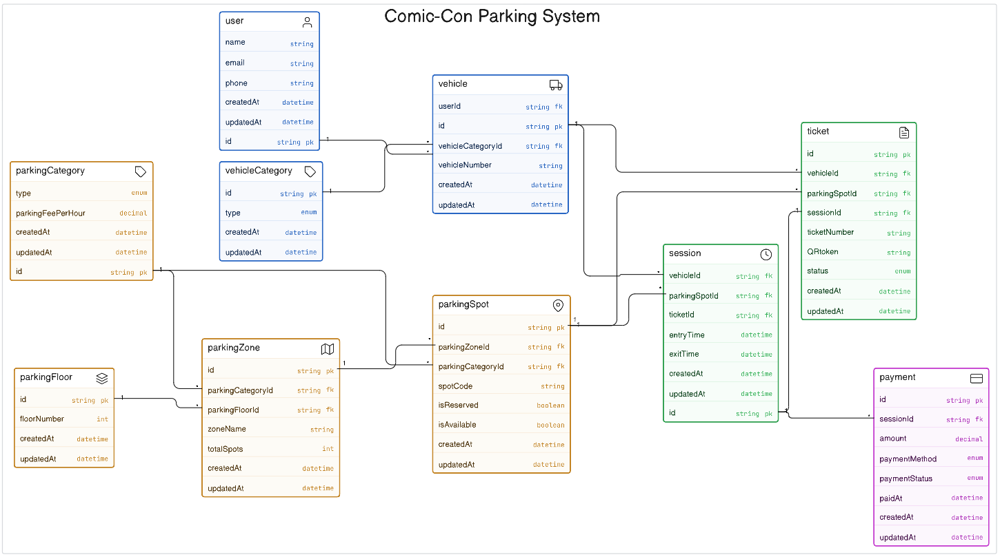

```JS
// Comic Con India - Parking System ERD

user [icon: user, color: blue] {
  id string pk
  name string
  email string
  phone string
  createdAt datetime
  updatedAt datetime
}

vehicle [icon: truck, color: blue] {
  id string pk
  userId string fk
  vehicleCategoryId string fk
  vehicleNumber string
  createdAt datetime
  updatedAt datetime
}

vehicleCategory [icon: tag, color: blue] {
  id string pk
  type enum
  createdAt datetime
  updatedAt datetime
}

parkingFloor [icon: layers, color: orange] {
  id string pk
  floorNumber int
  createdAt datetime
  updatedAt datetime
}

parkingCategory [icon: tag, color: orange] {
  id string pk
  type enum
  parkingFeePerHour decimal
  createdAt datetime
  updatedAt datetime
}

parkingZone [icon: map, color: orange] {
  id string pk
  parkingCategoryId string fk
  parkingFloorId string fk
  zoneName string
  totalSpots int
  createdAt datetime
  updatedAt datetime
}

parkingSpot [icon: map-pin, color: orange] {
  id string pk
  parkingZoneId string fk
  parkingCategoryId string fk
  spotCode string
  isReserved boolean
  isAvailable boolean
  createdAt datetime
  updatedAt datetime
}

session [icon: clock, color: green] {
  id string pk
  vehicleId string fk
  parkingSpotId string fk
  ticketId string fk
  entryTime datetime
  exitTime datetime
  createdAt datetime
  updatedAt datetime
}

ticket [icon: file-text, color: green] {
  id string pk
  vehicleId string fk
  parkingSpotId string fk
  sessionId string fk
  ticketNumber string
  QRtoken string
  status enum
  createdAt datetime
  updatedAt datetime
}

payment [icon: credit-card, color: purple] {
  id string pk
  sessionId string fk
  amount decimal
  paymentMethod enum
  paymentStatus enum
  paidAt datetime
  createdAt datetime
  updatedAt datetime
}

// Relationships
user.id < vehicle.userId
vehicleCategory.id < vehicle.vehicleCategoryId
parkingFloor.id < parkingZone.parkingFloorId
parkingCategory.id < parkingZone.parkingCategoryId
parkingCategory.id < parkingSpot.parkingCategoryId
parkingZone.id < parkingSpot.parkingZoneId
vehicle.id < session.vehicleId
parkingSpot.id < session.parkingSpotId
session.id - ticket.sessionId
session.id < payment.sessionId
vehicle.id < ticket.vehicleId
parkingSpot.id < ticket.parkingSpotId
```
