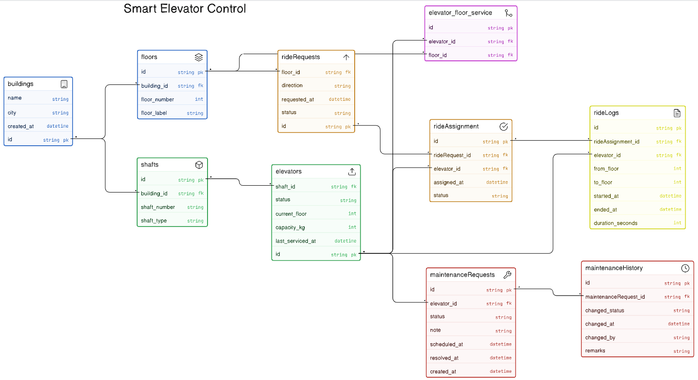

```JS
buildings [icon: building, color: blue] {
  id string pk
  name string
  city string
  created_at datetime
}

floors [icon: layers, color: blue] {
  id string pk
  building_id string fk
  floor_number int
  floor_label string
}

shafts [icon: box, color: green] {
  id string pk
  building_id string fk
  shaft_number string
  shaft_type string
}

elevators [icon: upload, color: green] {
  id string pk
  shaft_id string fk
  status string
  current_floor int
  capacity_kg int
  last_serviced_at datetime
}

elevator_floor_service [icon: git-merge, color: purple] {
  id string pk
  elevator_id string fk
  floor_id string fk
}

rideRequests [icon: arrow-up, color: orange] {
  id string pk
  floor_id string fk
  direction string
  requested_at datetime
  status string
}

rideAssignment [icon: check-circle, color: orange] {
  id string pk
  rideRequest_id string fk
  elevator_id string fk
  assigned_at datetime
  status string
}

rideLogs [icon: file-text, color: yellow] {
  id string pk
  rideAssignment_id string fk
  elevator_id string fk
  from_floor int
  to_floor int
  started_at datetime
  ended_at datetime
  duration_seconds int
}

maintenanceRequests [icon: tool, color: red] {
  id string pk
  elevator_id string fk
  status string
  note string
  scheduled_at datetime
  resolved_at datetime
  created_at datetime
}

maintenanceHistory [icon: clock, color: red] {
  id string pk
  maintenanceRequest_id string fk
  changed_status string
  changed_at datetime
  changed_by string
  remarks string
}

// Relationships

buildings.id <> floors.building_id
buildings.id <> shafts.building_id
shafts.id <> elevators.shaft_id
elevators.id <> elevator_floor_service.elevator_id
floors.id <> elevator_floor_service.floor_id
floors.id <> rideRequests.floor_id
rideRequests.id <> rideAssignment.rideRequest_id
elevators.id <> rideAssignment.elevator_id
rideAssignment.id <> rideLogs.rideAssignment_id
elevators.id <> rideLogs.elevator_id
elevators.id <> maintenanceRequests.elevator_id
maintenanceRequests.id <> maintenanceHistory.maintenanceRequest_id
```
